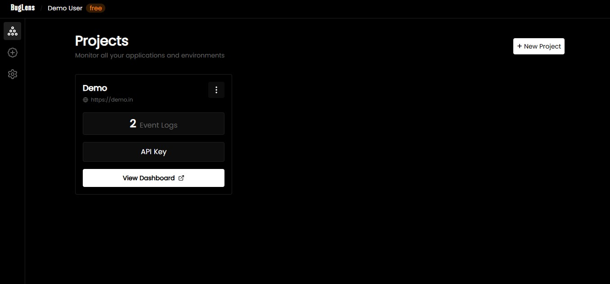
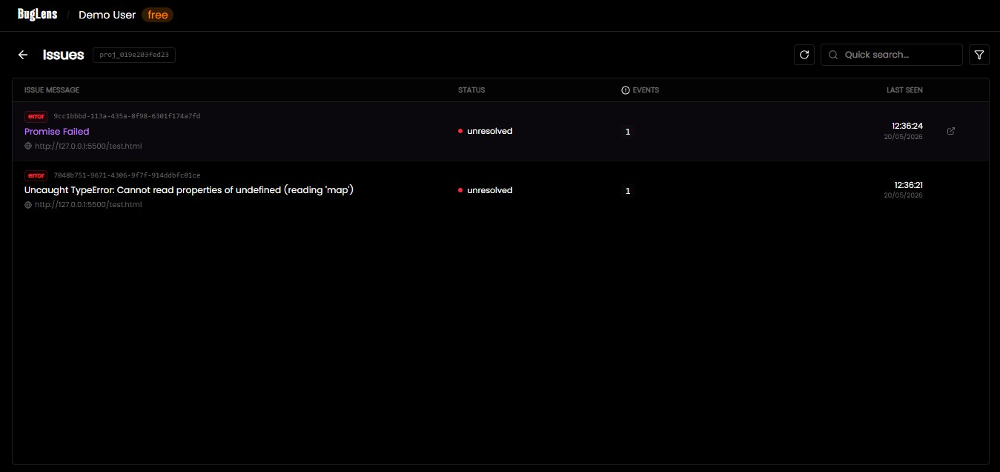

# BugLens

Real-Time Error Monitoring & Debug Intelligence Platform

BugLens is a distributed real-time error monitoring platform built for capturing, processing, and visualizing frontend runtime exceptions across multiple isolated projects.

It provides developers with instant visibility into production-side failures through live error streaming, stack trace inspection, project-level event isolation, and real-time dashboard synchronization powered by WebSockets.

---

## Overview

Modern frontend applications often fail silently in production, making debugging slow and inefficient.

BugLens solves this by providing:

- Automatic frontend error interception
- Real-time exception streaming
- Project-scoped monitoring
- Live dashboard synchronization
- Stack trace inspection
- Centralized debugging visibility

The platform is designed to help developers identify, inspect, and respond to runtime failures instantly without manual log tracing.

---

## Key Features

### Real-Time Error Streaming
Errors are broadcast instantly to connected dashboards using WebSocket-based socket communication.

### Lightweight JavaScript SDK
Client-side SDK captures:

- Runtime exceptions
- Stack traces
- Error metadata
- Browser context
- Timestamped events

### Project-Based Isolation
Each project has isolated error streams for secure and organized monitoring.

### Interactive Monitoring Dashboard
Live interface for:

- Error stream visualization
- Stack trace inspection
- Search and filtering
- Project-level debugging insights

### Disk-Based Queue Processing
Asynchronous event ingestion with non-blocking queue handling for optimized log processing.

### Fault-Tolerant WebSocket Lifecycle Management
Includes:

- Connection tracking
- Dead socket cleanup
- Session lifecycle control
- Reliable event delivery

### Cold Start Reliability Optimization
Deployment uptime stabilized using persistent health-check monitoring.

---

## System Architecture

```text
Frontend Application
       │
       ▼
BugLens SDK
(Error Interception)
       │
       ▼
Ingestion API (FastAPI)
       │
       ▼
Disk-Based Queue
       │
       ▼
Error Processor
       │
       ▼
Persistent Storage
       │
       ▼
WebSocket Broadcast Layer
       │
       ▼
Live Monitoring Dashboard
```

---

## Tech Stack

### Frontend
- React.js
- Tailwind CSS

### Backend
- FastAPI
- Python AsyncIO
- WebSockets

### Database / Storage
- PostgreSQL
- Disk-Based Queue System

### Deployment
- Render
- Vercel

---

## Dashboard UI

The dashboard provides:

### Error Feed
Live runtime exception stream

### Stack Trace Inspector
Detailed exception breakdown for debugging

### Search & Filtering
Search errors by message and metadata

### Project Monitoring
Project-specific error visualization

---

## Real-Time Event Flow

### 1. Error Captured
Frontend runtime exception intercepted by SDK

### 2. Event Enriched
Metadata + stack trace extracted

### 3. Error Sent
Asynchronous event delivery to ingestion endpoint

### 4. Queued
Stored in disk-based processing queue

### 5. Persisted
Written to storage

### 6. Broadcast
WebSocket layer pushes event to connected dashboards

### 7. Visualized
Dashboard updates instantly

---

## Performance Highlights

- Low-latency real-time broadcasting
- Non-blocking asynchronous event processing
- Optimized client-server communication
- Reduced cold-start delays
- Project-scoped socket isolation

---

## Use Cases

BugLens is useful for:

- Frontend production monitoring
- Runtime exception tracking
- Real-time debugging workflows
- Multi-project observability

---

## Future Improvements

Planned enhancements:

- AI-powered error explanation
- Error grouping & fingerprinting
- Team collaboration workflows
- Alerting system
- Historical analytics
- Severity classification

---

## Screenshots

### Dashboard



### Issue Page



---

## Author

Vinayak Mishra

LinkedIn: https://linkedin.com/in/vinayak-mishra-b14412351
